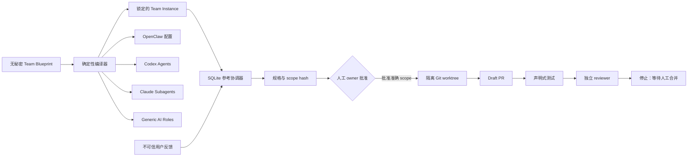

# 团队蓝图编译器与参考运行时

本文回答三个问题：这个仓库现在能做什么、别人怎样用它创建自己的 Agent 团队、哪些部分仍需要采用环境自己接入。

## 产品结论

`agent-team-engineering` 是“团队工厂”，不是某个业务项目的一支固定团队，也不是新的大模型或多智能体聊天框架。输入是一份项目绑定和团队蓝图；输出是：

- 一个可验证、可迁移、可升级的 Team Instance；
- OpenClaw、Codex、Claude 和通用 AI 的原生角色资产；
- 一条可重启的“反馈 → 分析 → 规格 → 人工批准 → 开发 → Draft PR → 测试 → 独立复核”参考运行链；
- 项目、角色、revision、批准、测试和外部副作用的审计证据。

它不会把 owner 创建为 Agent，不会把聊天当审批，不会自动 merge，也不会生产部署。



## 三类资产与权威

| 资产 | 保存什么 | 不保存什么 |
|---|---|---|
| Factory | 通用编译器、运行时、Schema、团队包、Skill、迁移 | 某个项目的秘密和业务源码 |
| Team Instance | owner、项目绑定、角色引擎、平台产物、运行状态和审计 | Factory 源码、Token、生产数据 |
| Target Project | 产品原则、架构、源码、测试、Issue、PR、分支保护 | 通用 Factory 实现和团队数据库 |

Team Instance 可以单独进入一个 Private Git 仓库，但 `runtime/`、工作树、SQLite 和秘密始终排除。业务源码继续留在原项目。

## 角色不是名称列表，而是分权

| 角色 | 可以做 | 明确不能做 |
|---|---|---|
| public-intake | 把公开反馈规范化为数据 | Shell、Git 写入、审批 |
| triage | 判断需求是否合理、风险分类 | 改源码、批准方案 |
| product | 写可验收规格 | 实现或自批 |
| owner（人） | 批准准确 scope、暂停 | 被模型模拟 |
| builder | 在独立 worktree 改代码并提交 | 自审、merge、部署 |
| qa | 复核声明式测试证据 | 豁免失败、改源码 |
| reviewer | 独立审查当前 branch 与 base | 修改作者分支、自审 |
| release / operations | 为后续采用项目保留发布治理接口 | 在 v0.6 Team Runtime 中 merge 或部署 |

## 十分钟验证真实闭环

第一条命令创建一个新的 Team、一个最小 Git 项目和一条反馈，然后自动运行到人工门禁。它不联网、不调用真实模型，也不写 GitHub：

```bash
python3 tools/agent_team.py team demo --output /tmp/agent-team-demo
```

输出必须为 `WAITING_FOR_HUMAN`、状态为 `SPEC_READY`，并给出完整 `scope_hash`。此时目标项目还没有实现文件，也没有 worktree。

人工阅读 `/tmp/agent-team-demo/team/runtime/artifacts/<work-id>/specification.json`，确认范围后原样回填 hash：

```bash
python3 tools/agent_team.py team approve-plan \
  --root /tmp/agent-team-demo/team \
  --work-item '<work-id>' \
  --scope-hash 'sha256:<完整摘要>'
```

然后继续运行。`--allow-host-runner` 是独立的本机进程执行同意，不由计划批准推导：

```bash
python3 tools/agent_team.py team run \
  --root /tmp/agent-team-demo/team \
  --work-item '<work-id>' \
  --repo /tmp/agent-team-demo/project \
  --runner-profile /tmp/agent-team-demo/runner-profile.json \
  --model-mode reference \
  --provider local \
  --allow-host-runner
```

完成标准是 `DRAFT_PR_READY`、工作项 `REVIEW_APPROVED`、测试 `PASSED`、PR `draft=true`，且 builder 与 reviewer ID 不同。再次运行必须只返回已有结果，不重复提交或增加审计事件。

## 为自己的项目生成团队

### 1. 准备蓝图

复制 `examples/team-blueprint/input/team.json` 到项目外的提案目录，至少修改：

- `team_id`、`instance_id`、显示名；
- human owner 与 plan approver；
- `projects[].id/provider/locator/default_branch`；
- 每个非人工角色的 engine、model、reasoning 和 sandbox；
- 要生成的 `platform_targets`。

蓝图必须无秘密。`secret_refs` 只是逻辑名字，不能写 Token、密码或密钥。

### 2. 编译到新目录

```bash
python3 tools/agent_team.py team create \
  --blueprint /safe/proposal/team.json \
  --output /new/path/my-agent-team

python3 tools/agent_team.py team validate --root /new/path/my-agent-team
python3 tools/agent_team.py team inspect --root /new/path/my-agent-team
```

编译不会覆盖已有目录。`.agent-team/team.lock.json` 记录 blueprint 摘要、Factory 来源、平台格式与所有生成文件摘要。

### 3. 接入一个平台

```bash
python3 tools/agent_team.py team export \
  --root /new/path/my-agent-team \
  --target codex \
  --output /new/path/codex-overlay
```

Export 也只写新目录。通过目标项目的提案分支合并覆盖层；若项目已有 `AGENTS.md`、`CLAUDE.md`、`.codex/` 或 `.claude/`，必须人工协调，不能直接覆盖。

### 4. 启用模型路由

要让参考协调器调用真实 Codex/Claude，需要在编译前把 instance 的 `model` slot 显式设为：

```json
{
  "slot": "model",
  "adapter_id": "adapter.cli-model-router",
  "enabled": true,
  "config": {},
  "secret_refs": ["secret.local-agent-session"]
}
```

`secret.local-agent-session` 不含秘密值，只声明采用环境承担本机 CLI 会话边界。参考Router只向模型进程传递PATH、HOME、locale和证书位置等最小环境，不传递`OPENAI_API_KEY`、`ANTHROPIC_API_KEY`或其他继承变量；应使用已审阅的本机CLI登录会话，或另行实现隔离的凭据代理。HOME中的会话文件仍属于受控主机信任边界，因此live模式不能处理恶意仓库。运行时按role binding选择Codex或Claude；OpenClaw/Generic AI角色应由各自原生运行时消费生成资产，不能被CLIRouter冒充。

### 5. 写 Runner Profile

Runner Profile 位于 Team Instance 外，由 owner/工程维护者审阅：

```json
{
  "schema_version": "1.0.0",
  "project_id": "project.my-product",
  "working_directory": ".",
  "commands": [
    {"id": "unit-tests", "argv": ["python3", "-m", "unittest"], "timeout_seconds": 600}
  ]
}
```

命令是 argv，不经过 Shell，也不能携带秘密。第一次运行会把完整Runner Profile摘要和command IDs写入specification scope；人工计划批准后文件发生任何变化都会失败，不能用更弱测试替换已批准门禁。参考 Host Runner 使用最小环境但不提供网络、容器或 VM 隔离；处理公开 PR、第三方依赖脚本或恶意仓库时，必须替换为符合 `execution-request.schema.json` 的独立 Runner。

### 6. 写入反馈并运行

```bash
python3 tools/agent_team.py team ingest \
  --root /new/path/my-agent-team \
  --event /safe/input/feedback.json \
  --idempotency-key 'feedback:channel:message-id'

python3 tools/agent_team.py team run \
  --root /new/path/my-agent-team \
  --work-item '<work-id>' \
  --repo /path/to/clean/project \
  --runner-profile /safe/config/runner-profile.json \
  --model-mode live \
  --provider local
```

第一次必定停在 plan gate。批准后再次运行，并在真正执行本机测试时加 `--allow-host-runner`。

多项目Team必须额外传入 `--project-id project.example`。项目ID、provider、locator、本地仓库路径、default branch及准确base commit、project mode、model mode、delivery provider、Runner Profile摘要和command IDs既在工作项第一次运行时持久绑定，也进入人工批准的scope hash；后续不能把同一个审批切换到另一个仓库、代码基线、模型、交付模式或更弱的测试集合。若批准后、worktree创建前默认分支已经移动，当前工作项安全停止，应在新基线上重新生成规格和取得批准。

## GitHub 模式

真实 GitHub 写入需要同时满足：

1. project provider/locator 与 Git remote `origin` 一致；
2. `code-hosting` slot 显式启用 `adapter.github` 并具有外部 secret reference；
3. `gh` 已由采用环境以最小仓库权限认证；
4. 命令显式选择 `--provider github --allow-provider-writes`；
5. 目标仓库处于 `proposal-only`，默认分支与蓝图一致。

运行时只允许创建 Issue、推送 `agent-team/<work-id>` 隔离分支和创建 Draft PR。GitHub 写入使用稳定隐藏标记对账，进程中断后先查找既有对象，不盲目重复创建。Factory 没有 PR merge 操作。

不要用 Factory 自身仓库做试验。先在临时 Private 仓库验收 GitHub App/账号权限、分支保护、对账、日志脱敏与撤销路径。

## OpenClaw 的准确边界

生成的 `openclaw.fragment.json` 使用 `agents.list`，为每个角色创建独立 workspace，并能把 Codex/Claude 角色声明为 ACP runtime。公开 intake 与 approval relay 是不同 Agent，初始 `bindings=[]` 是故意的安全停止。

采用者仍需在自己的 OpenClaw Gateway 中：

- 替换绝对 Team/项目路径；
- 为公开反馈和审批分别配置账号、频道、路由与凭据；
- 验证 `openclaw doctor`、Agent bindings 和 sandbox explain；
- 把认证后的审批转换为绑定断言；
- 将 Gateway 事件接到持久控制平面或实现等价的结构化接口。

因此，Factory 能创建 OpenClaw 团队资产和治理协议，但 v0.6 不假装已经替用户配置其频道、账号或常驻 Gateway。

## 重启、恢复与停止条件

- SQLite、artifacts 和 worktrees 位于 Team 的 `runtime/`，不进入普通 Git；
- 每个模型调用先进入 outbox，并可按准确 effect ID 恢复；at-most-once 的不确定调用不会盲重放；
- GitHub 创建操作重试前用稳定标记对账；
- 规格、workspace、commit intent、commit、PR 与 Runner Evidence 都有单独runtime artifact；worktree创建与commit落盘后的中断可以从受约束的Git事实重建缺失记录；
- Runner Evidence先自校验内容摘要，再与Runner Profile、work item、Draft PR commit及SQLite CI审计事件交叉绑定；只改文件或自行重算文件摘要都不能维持通过状态；
- source repository 必须干净，writer 使用独立 worktree；测试后 worktree 发生任何变化都会失败；
- managed 资产、blueprint、lock、项目、base commit、branch、scope、revision 或身份不匹配时安全停止。

备份 Team Instance 的 Git 权威与 SQLite verified backup；目标项目由其 Git 托管恢复；外部 Issue/PR 需通过 provider 对账。三者不能互相替代。

## 当前完成度

v0.6 已完成“可复制团队工厂 + 可执行参考闭环”，不是长期无人值守服务。下一层采用工程可以增加常驻调度器、OpenClaw 事件适配器、真正的隔离 Runner、远程身份提供者和观测告警，但必须继续使用现有 Schema、门禁、outbox 与审计接口，不能通过平台特性绕开人工批准和 Draft PR 停止线。
